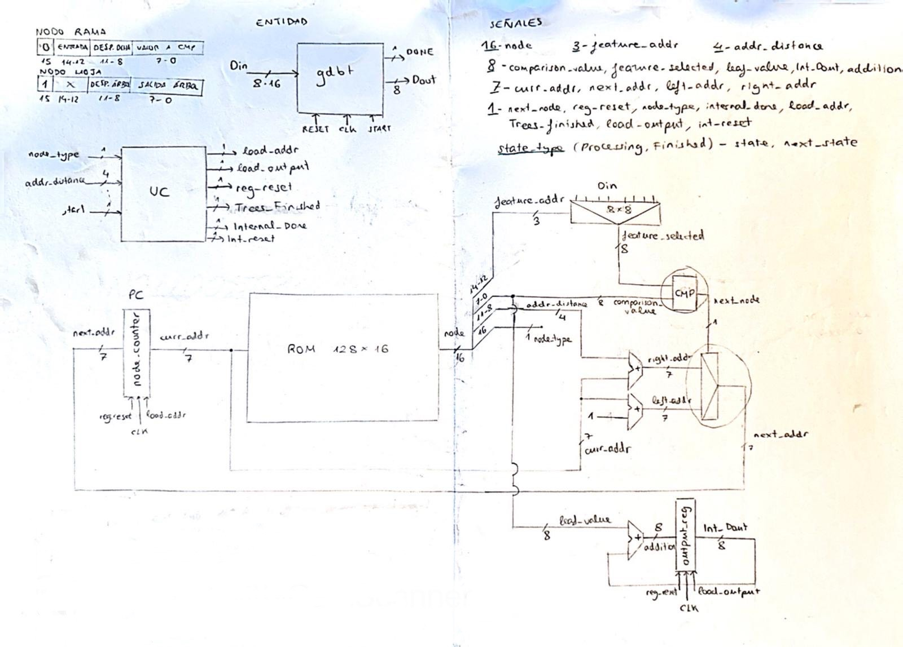
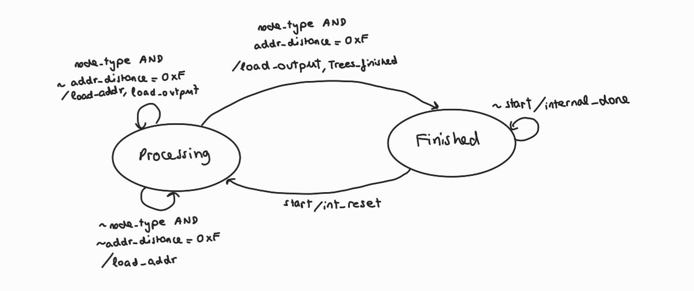
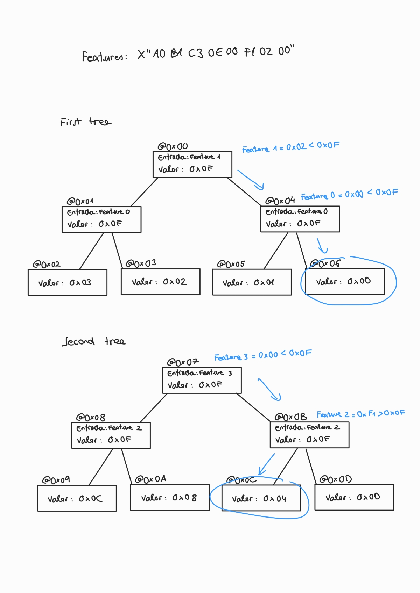
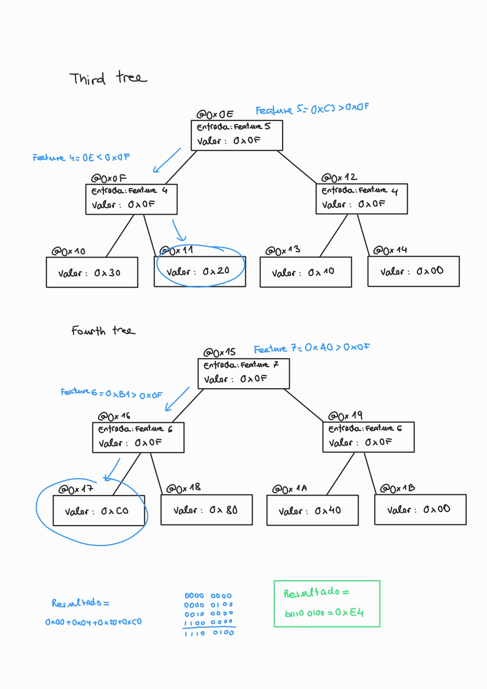
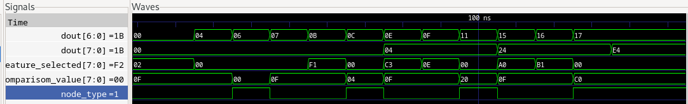
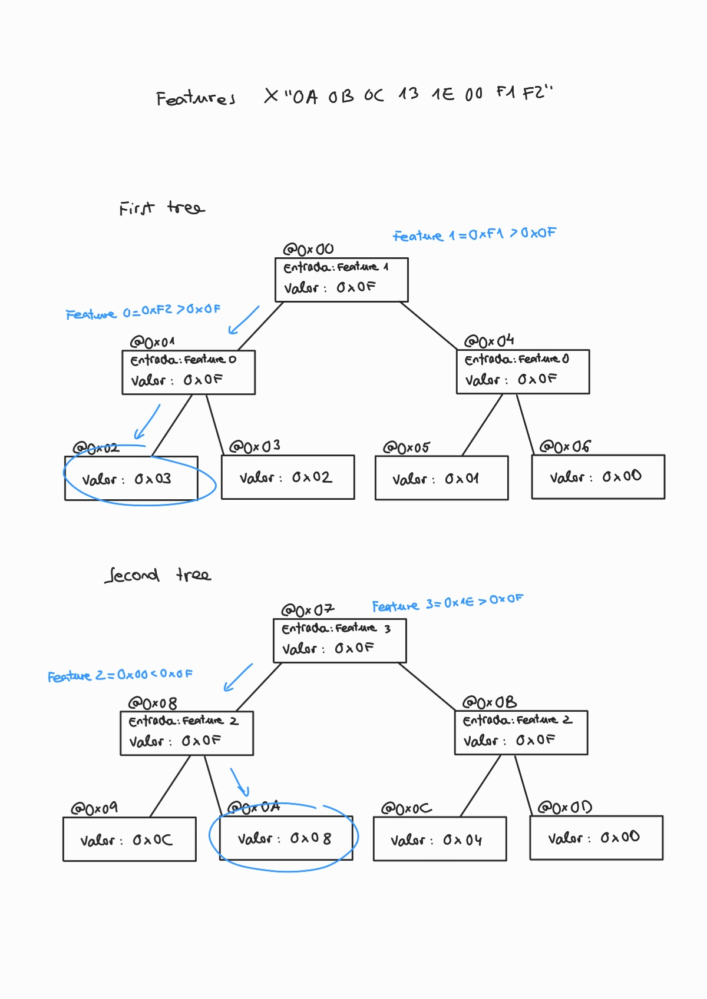
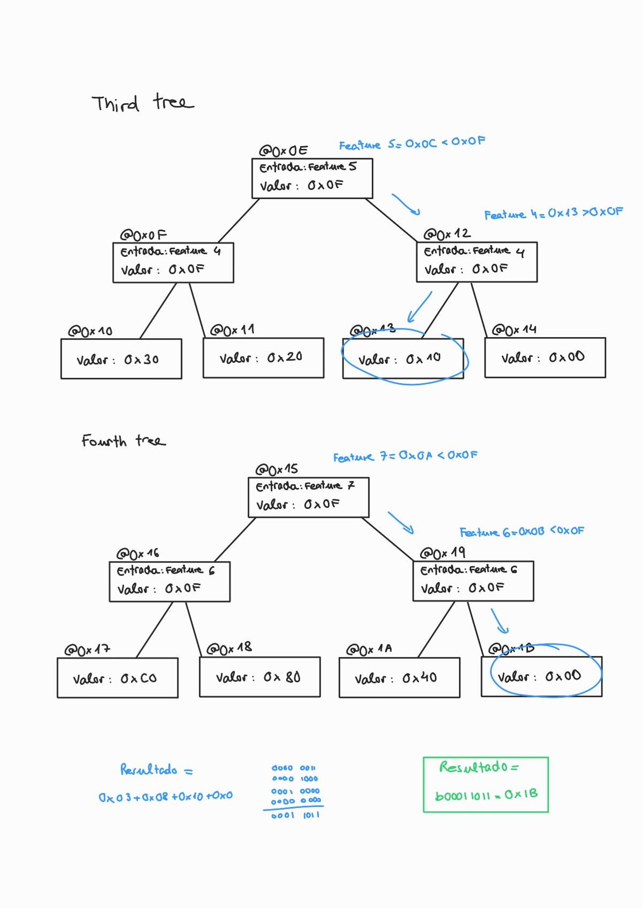
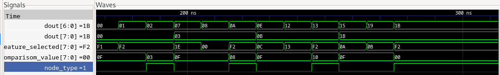

# Práctica 2: diseño de un acelerador para árboles GBDT
Segunda práctica de laboratorio de la asignatura Laboratorio de Sistemas Empotrados 2024/25 de la Universidad de Zaragoza. El objetivo de esta sesión es completar el diseño de un acelerador de árboles tipo “GBDT”
siguiendo un esquema sencillo.

## Mapa del procesador


## Autómata de estados de la UC
Si no aparecen como salida de una transición, las señales `load_addr`, `Internal_Done`, `int_reset`, `load_output`, `load_addr` y `Trees_finished` toman valor '0'.


## Resultados
### Ejemplo 1
La entrada del ejemplo 1 para las features es: X"A0B1C30E00F10200".
El camino que sigue esta entrada por los árboles es:


Vemos que al ejecutar obtenemos el mismo resultado. La primera señal es la dirección del nodo y la segunda el 'output_reg' donde se acumulan los resultados de cada árbol:


### Ejemplo 2
La entrada del ejemplo 2 para las features es: X"0A0B0C131E00F1F2".
El camino que sigue esta entrada por los árboles es:


Vemos que al ejecutar obtenemos el mismo resultado:


## Compilar y ejecutar el testbench
```
    rm WORK/*
    
    ghdl -i --ieee=synopsys -fexplicit --workdir=WORK *.vhd

    ghdl --gen-makefile --ieee=synopsys -fexplicit --workdir=WORK testbench  > Makefile

    make

    ./testbench --stop-time=500ns --wave=test.ghw

    gtkwave test.ghw &
```